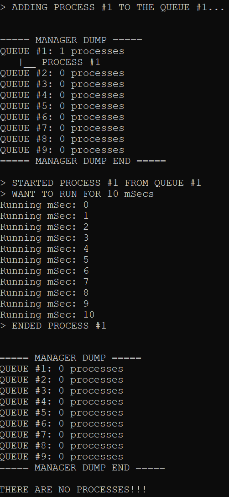

# Process_Manager_Simulator
## DESCRIPTION
### Brief description
A test of implementing the basic work mechanic of processes managers (not actually implementing them) with C++20 coroutines.  
This is basically the Foreground Background algorithm. It suggests we have N queues. There the processes will be put on creating. 
Each process has a number associated with it, based on the actual order of the task appearance. There is also a hash-table containing pairs of
`process_number -> queue_of_the_process`.
### Algorithm description   
#### `resumable_no_own` struct
This struct implements the basic coroutine with void return type. We use these coroutines as processes.
#### `awaiter` struct
This struct implements the awaitable object we use to _subscribe_ the process to the ProcessManager.
#### `ProcessManager` class
This class is the master of the `awaiter` struct, it is used for managing incoming processes: adding to queues, resuming them, dumping the 'each tact' state of the queues.
## HOW TO USE
To use the algorithm, build the Source1.cpp file using Microsoft's __cl__ or any other compiler supporting C++20.
You could also try to use the [C++ shell website to compile the code](http://cpp.sh/), in case they already support C++20.   
Describe your use cases in `main()` function or implement it in separate function, then calling it in `main()` function.

## DEMONSTRATION

> All queue state outputs are made with the class ProcessManager `dump` function, which, basically, goes through the queue and prints the states 
of all the existing Processes in there.     
> In these examples we consider the `MAX_TIME_QUANT` to be 10.      
> The `processManager` is a global variable.

#### The creation of a new process that has to run for 10ms
> Second call of the `dump` method is used to demonstrate the queue state after the process is ended.
##### Code
```  
runProcess(10);     
   
processManager.dump(processManager);    
processManager.dump(processManager);    
```
##### Output

